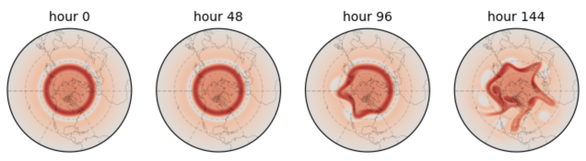

This repository contains python notebooks made to run on Google Colab.

<b> shallow_water_model_shtns.ipynb </b> 

This google colab notebook runs a shallow water model based on the SHTns package for spherical harmonic transforms, from Nathanaël Schaeffer: https://bitbucket.org/nschaeff/shtns/src/master/. The SW model runs the non-linear barotropically unstable shallow water test case, based on the example provided by Jeffrey Whitaker: https://gist.github.com/jswhit/3845307. The work of Nathanaël and Jeff, the availability of Google Colab, and support from NOAA MAPP NA20OAR4310424 is gratefully acknowledged.

